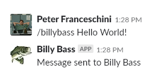

# Slacking Bass

Slacking Bass is an ASP.NET Core 2.2 implementation of the Slack Slash Command API, paired with Alexa's notification service to allow Slack users to send audio messages to an Alexa device (preferablly an [Alexa enabled Billy Bass](https://www.amazon.com/Big-Mouth-Billy-Bass-Compatible/dp/B07657LKNZ)) from a Slash Command.

## Integrations
* [Slack Slash Commands](https://api.slack.com/slash-commands)
* [Alexa NotifyMe](http://www.thomptronics.com/notify-me)

## Installation / Usage

### Requirements
* .NET Core 2.2
* Slack Team with administrative privileges 

### Application Setup
1. Pull the latest code from the master branch of this repository
1. Build and publish the application to your desired web server
    * Web server must have [.Net Core 2.2 Runtime](https://dotnet.microsoft.com/download/dotnet-core/2.2) installed 

### Slack Setup
1. Setup a new Slack App in the [Slack API dashboard](https://api.slack.com/apps)
1. Update your application configuration file or secrets storage with your Slack Singing Secret from the App Credentials section of your new Slack App
1. Add the Slash Command feature to your new Slack App
1. Add a new Command with the following details:
    * Command: /billybass
    * Request URL: [Your Server URL]/api/SlashCommand
    * Short Description: [message for billy]
    * Usage Hint: [message for Billy Bass]
1. Deploy your new Slack app to your Slack Team

### Alexa NotifyMe Skill Setup 
1. Install the [Alexa NotifyMe Skill](https://www.amazon.com/Thomptronics-Notify-Me/dp/B07BB2FYFS) on your Alexa device 
1. Retrieve your NotifyMe access code via email
1. Update your application configuration file or secrets storage with the application configuration

### Testing
1. Open Slack and invoke */BillyBass* [message]
1. Success!

## Commands
* */billybass* [Message to send] - Sends a message to the Billy Bass